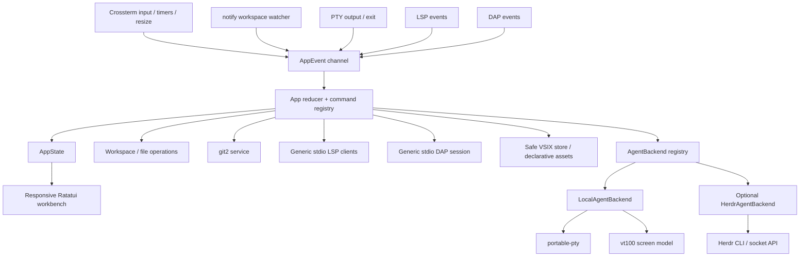

# Architecture

TermLoom is a standalone Rust application with one reducer-style event loop.
Infrastructure owns threads, subprocesses and protocol framing; application
state is plain data; Ratatui widgets only render that state.

## Boundaries

- `src/domain`: protocol-independent agent, Git, diagnostic, debug, terminal,
  and extension models.
- `src/services`: filesystem, Git, PTY/VT, syntax, LSP, DAP, VSIX,
  persistence, watcher, VS Code config, and backend adapters.
- `src/app`: commands, focus/input routing, state and the event loop.
- `src/ui`: responsive layouts and pure rendering.
- `src/cli`: doctor and extension management.
- `integrations/herdr`: a thin launcher, not another copy of TermLoom.

Background producers send semantic events to the workbench. PTY screens are
shared behind the terminal manager; they are never reduced to fake captured
command output. LSP and DAP share standards-compliant `Content-Length` framing
but maintain independent lifecycle/state machines.

## Trust boundaries

Repository tasks and debug adapters require an explicit user action. VSIX
archives are path-validated and extracted into an isolated data directory;
symlinks, traversal and missing assets are rejected. Extension entrypoints are
reported but never executed. Agent state keeps provenance and the UI never
attributes Git changes to an agent as fact.
