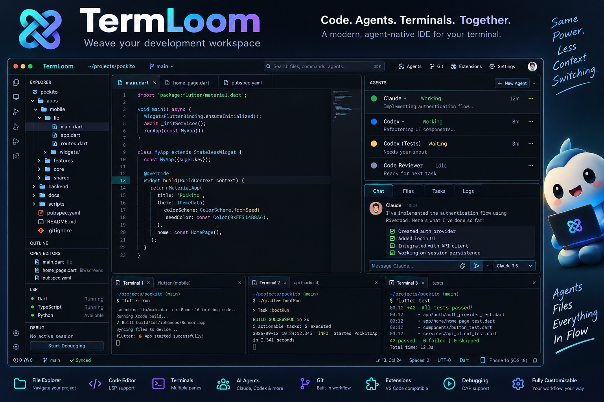

# TermLoom

> **TermLoom is an agent-native development environment for your terminal.**

**Weave your development workspace.** Browse and edit a repository, inspect Git
changes, run real interactive terminals, supervise Claude/Codex sessions, use
LSP and DAP tooling, and safely reuse declarative VS Code extension assets
without leaving one keyboard-first TUI.



## Install and run

TermLoom V1 supports macOS and Linux and requires Rust 1.90 or newer to build:

```bash
cargo install --path .
cd /path/to/project
termloom .
```

Useful non-interactive commands:

```bash
termloom --help
termloom doctor
termloom config
termloom extension inspect ./extension.vsix
```

`F1` shows the full key reference. The central workbench prefix is
`Ctrl+Space`; press it and then `E`, `G`, `A`, `T`, `C`, `X`, or `P` to focus
Explorer/Git/Agents, open a terminal, launch Claude/Codex, or open the command
palette. `Ctrl+P` opens files, and editor-local `Ctrl+S`, `Ctrl+F`, and
`Ctrl+W` save, search, and close a tab. Normal input is passed unchanged when
a child terminal has focus.

## What works in V1

- Lazy project explorer, tabs, UTF-8 editing, selection, clipboard, undo/redo,
  search, external-change protection, Tree-sitter highlighting and outline.
- Git branch/status/diff, stage/unstage, and confirmed discard.
- Multiple real PTYs with ANSI/VT rendering, cursor, resize, scrollback,
  process lifecycle, restart, and terminal-first key routing.
- Local Claude, Codex, shell, and custom-command sessions with conservative
  state detection. No account is required by TermLoom.
- Generic stdio LSP and DAP clients, Problems/completion/hover/navigation and a
  compact breakpoint/stack/variables debug UI.
- Local VSIX inspection, classification, isolated installation and removal.
  Language associations, snippets and color themes load natively. TextMate
  grammar files are preserved but require an adapter because V1 syntax
  rendering uses Tree-sitter. Extension JavaScript and webviews never run.
- Workspace restoration for open files, cursor positions, layout, and
  explicitly restorable terminal commands.
- Optional Herdr discovery/control when TermLoom is launched inside Herdr (or
  explicitly enabled); local PTYs always remain available.

## Configuration

Global configuration lives at the platform config directory
(`~/.config/termloom/config.toml` on typical Linux systems). A repository can
add `.termloom.toml`. Print the complete defaults with `termloom config` or
create the global file with `termloom config --write-default`.

```toml
[ui]
theme = "termloom-dark"
mouse = true

[agents.claude]
label = "Claude"
command = "claude"

[lsp.rust-analyzer]
command = "rust-analyzer"
languages = ["rust"]
root_markers = ["Cargo.toml"]

[dap.lldb]
command = "lldb-dap"
types = ["lldb"]

[herdr]
mode = "auto" # auto | enabled | disabled
```

An installed extension theme is selected with
`theme = "publisher.extension:Theme Label"`. See
[configuration](docs/configuration.md), [language services](docs/language-services.md),
[debugging](docs/debugging.md), and [extensions](docs/extensions.md).

## Standalone and Herdr

TermLoom owns its UI, editor, terminal runtime, IDE protocols, and agent model.
Herdr is an optional backend, never a dependency or host architecture. In
`auto` mode it connects only when `HERDR_ENV=1`; if Herdr disappears, local
editing and local agents keep working. The thin launcher is documented in
[Herdr integration](docs/herdr-integration.md).

## Known limits

V1 does not emulate the VS Code Extension Host, run webviews, provide remote
SSH workspaces, persist full terminal transcripts, or infer agent reasoning.
TextMate grammars are inspected and installed but need an explicit future
renderer adapter; the built-in language set uses Tree-sitter. Native Windows
support is not a V1 target.

## Development

```bash
cargo fmt --check
cargo clippy --all-targets --all-features -- -D warnings
cargo test --all-targets
cargo run -- doctor
cargo run -- .
```

Read [ARCHITECTURE.md](ARCHITECTURE.md), [CONTRIBUTING.md](CONTRIBUTING.md),
and [docs/development.md](docs/development.md). TermLoom is licensed under the
[MIT License](LICENSE).
