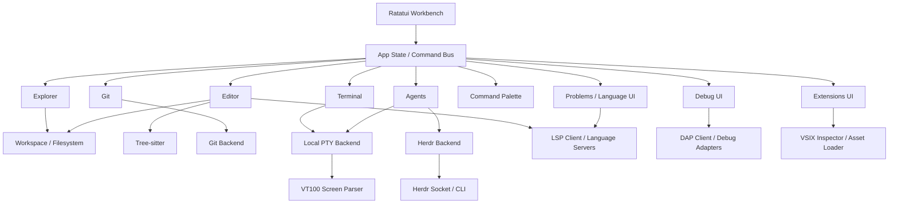

# TermLoom — V1 Product Requirements & Implementation Plan

> **Status:** Implementation handoff specification  
> **Product name:** **TermLoom**  
> **CLI command:** `termloom`  
> **Tagline:** **Agent-native development in your terminal.**  
> **Primary goal:** Build the terminal-native, agent-first IDE shown in the reference mockup: VS Code-like project navigation and editing combined with first-class Claude/Codex/agent terminals, agent status visibility, and a practical VS Code ecosystem compatibility layer.  
> **V1 strategy:** Standalone TUI application with a clean backend abstraction. It must work without Herdr, while shipping an optional Herdr adapter/plugin for richer persistent agent-session control. V1 also includes protocol-level compatibility with LSP/DAP plus safe reuse of declarative VS Code extension assets; it must not attempt to emulate the full VS Code Extension Host.

---

## 1. Agent Execution Brief

Implement V1 described in this document end-to-end. Do not stop at a static UI prototype. The result must be a usable developer tool that can open a real repository, browse and edit files, run interactive shells/CLI coding agents, show Git state, display agent state, consume language/debug protocols, and inspect/install supported VS Code-compatible extension assets.

Prioritize a coherent, stable vertical slice over feature count. Do **not** build a new shell, new terminal protocol, new parser engine, new Git implementation, or a Herdr fork. Use mature libraries and keep integrations behind interfaces.

The reference mockup is the visual source of truth for overall information architecture, density, hierarchy, borders, tab treatment, panels, agent states, terminal cards, and status bar. Exact pixel matching is impossible in a terminal and is not required; the goal is the same feel and workflow.

### Definition of success for V1

A developer can run:

```bash
termloom .
```

inside a Git repository and immediately get:

1. a project explorer,
2. an editable file view with tabs,
3. Git change indicators,
4. multiple interactive terminal/agent panes,
5. an agent dashboard showing Claude/Codex state,
6. a command palette and keyboard navigation,
7. persisted workspace state after restarting the TUI,
8. optional Herdr integration if Herdr is installed,
9. VS Code ecosystem compatibility for at least one real LSP language server, one real DAP debug adapter, and local VSIX inspection/classification with supported declarative assets.

If those nine things work reliably, V1 is successful.

---

# 2. Product Vision

Modern coding-agent workflows are still fragmented:

- VS Code/Cursor provide a strong project UI but make terminal-native agents feel secondary.
- tmux/Zellij/Herdr provide great terminal sessions, but the project/file/editing experience is weaker than a modern IDE.
- Claude Code, Codex and similar agents are powerful, but several simultaneous agents are difficult to supervise.
- VS Code has an enormous language/debugging/configuration ecosystem, but most of that value is normally coupled to the VS Code UI and Extension Host.

The product should combine the strengths of both worlds:

```text
Traditional IDE                         Agent Multiplexer
──────────────                          ─────────────────
Explorer                               persistent terminals
Editor                                 agent processes
Tabs                                   parallel sessions
Git                                    status monitoring
Search                                 detach/reattach
Command palette                        orchestration
LSP/DAP + extension assets              agent/session backends
         \                              /
          \                            /
           └── TermLoom ────┘
```

The core idea is:

> **Agents are first-class workspace objects, not chat widgets bolted onto an editor.**

The name **TermLoom** reflects the product model: one terminal-native workbench that weaves files, editing, Git, shells, coding agents, language tooling, debugging, and extension assets into a single development workspace.

A user should be able to see what every agent is doing, open the files it changed, jump to its terminal, send input, inspect Git changes, run tests, and keep coding manually without changing tools.

---

# 3. Architecture Decision

## 3.1 Chosen direction

Build:

```text
                    ┌─────────────────────┐
                    │      TermLoom       │
                    │      TUI Core       │
                    └─────────┬───────────┘
                              │
          ┌───────────────────┼───────────────────┐
          │                   │                   │
          ▼                   ▼                   ▼
  Local Process Backend   Herdr Backend      VS Code Compat Layer
  PTY + process state     socket/CLI API     LSP / DAP / VSIX assets
          │                   │                   │
          └───────────────────┴───────────────────┤
                                                  ▼
                                           Future Backends
                                           tmux / SSH / etc.
```

The **UI and product model belong to this project**.

Herdr is an integration/backend, not the foundation of the UI.

## 3.2 Why not make this only a Herdr plugin?

Herdr already provides valuable primitives such as persistent terminal panes, workspaces, agent detection, session restore, CLI control, and a local socket API. However, its plugin API is currently described by Herdr as an **early interface**, and plugin panes/actions still operate inside Herdr's host model.

A plugin-only architecture would make it harder to own the complete IDE layout and would couple long-term product direction to Herdr UI/plugin constraints.

Therefore:

- integrate with Herdr,
- optionally ship a Herdr plugin/entrypoint,
- do not make core product functionality depend on Herdr.

## 3.3 Why not fork Herdr?

Do not fork Herdr for V1.

A fork creates unnecessary maintenance burden and mixes two product responsibilities:

1. terminal/session multiplexing,
2. agent-first IDE/workbench UX.

Only consider a fork later if a specific, documented blocker cannot be solved through Herdr's API/plugin surface.

## 3.4 Why Rust?

Use Rust for V1 unless the existing repository already has a compelling different stack.

Reasons:

- strong TUI ecosystem,
- good PTY/process libraries,
- fast startup,
- single native binary distribution,
- easy match with Herdr's ecosystem,
- good cross-platform path,
- suitable for terminal rendering/event loops.

---

# 4. Recommended Technical Stack

These are recommendations, not excuses to block implementation if one package proves unsuitable.

| Area | Recommended choice | Purpose |
|---|---|---|
| Language | Rust stable | Main implementation |
| TUI | Ratatui | Layout, panels, widgets, drawing |
| Terminal events | Crossterm | Keyboard, mouse, resize, alternate screen |
| Editor widget | `ratatui-textarea` or maintained equivalent | Basic editing, cursor, selection, undo/redo |
| Syntax parsing | Tree-sitter | Incremental parsing / highlighting / outline |
| PTY | `portable-pty` | Spawn interactive shells and agents |
| Terminal screen parser | `vt100` initially | Parse child ANSI/VT output into cells |
| Async runtime | Tokio | process/event/socket orchestration |
| Filesystem watch | `notify` | External file changes / refresh |
| Git | `git2` plus Git CLI fallback where useful | status/diff/branch metadata |
| Serialization | Serde + TOML/JSON | config/workspace state |
| Logging | tracing + tracing-subscriber | diagnostic logs |
| Errors | anyhow + thiserror | application/domain errors |
| Fuzzy matching | nucleo / skim matcher / equivalent | quick open / command palette |
| LSP protocol | JSON-RPC + LSP protocol types/schema | completion, diagnostics, navigation, symbols |
| DAP protocol | DAP JSON messaging + generated/typed protocol structures | debugging, breakpoints, stack/variables |
| VSIX handling | ZIP reader + `package.json` manifest parser | inspect/classify supported extension assets |
| TextMate assets | maintained grammar/theme parser where practical | reuse syntax themes/grammars from extensions |

### Technical source rationale

- Ratatui is specifically designed for rich, lightweight Rust terminal interfaces and supports nested dynamic layouts.
- `portable-pty` exposes a cross-platform PTY abstraction and is used by the WezTerm ecosystem.
- `vt100` parses terminal byte streams into an in-memory rendered screen, which is suitable for embedding child terminal applications.
- Tree-sitter is designed for incremental parsing fast enough for editor use.
- Herdr exposes a local socket API/CLI that can create/split/run/read panes and query agent state.
- LSP is intentionally editor-agnostic and lets one language server provide completion, definitions, references, hover and related features across multiple editors.
- DAP is likewise independent from the VS Code UI; debug adapters can run as standalone processes or servers.
- VS Code extensions are packaged as VSIX archives with a `package.json` manifest and can contain declarative contributions such as grammars, snippets, themes, languages and debugger metadata.

Do not hardcode library-specific data structures into domain interfaces. For example, `TerminalSession` must not expose `portable_pty::MasterPty` outside the infrastructure layer.

---

# 5. Target Platforms

## V1 required

- macOS arm64
- macOS x86_64 if CI runner/build environment allows it
- Linux x86_64

## Best effort

- Linux arm64

## Not required for V1

- native Windows support

Design interfaces so Windows can be added later. Do not insert Unix-only assumptions throughout the domain layer.

---

# 6. Primary User Experience

The reference layout should approximately map to this structure:

```text
┌────────────────────────────────────────────────────────────────────────────┐
│ termloom                  ~/projects/pockito                 branch: main   │
├──────────────┬────────────────────────────────────┬────────────────────────┤
│ EXPLORER     │ EDITOR TABS                        │ AGENTS                 │
│              ├────────────────────────────────────┤                        │
│ project/     │ main.dart                          │ ● Claude    Working    │
│  src/        │                                    │ ● Codex     Working    │
│   app/       │  source code                       │ ● Tests     Waiting    │
│    main.dart │                                    │ ○ Reviewer  Idle       │
│              │                                    ├────────────────────────┤
│              │                                    │ AGENT DETAIL / CHAT    │
│──────────────│                                    │                        │
│ OUTLINE      │                                    │ task/status/messages   │
│──────────────│                                    │                        │
│ GIT          │                                    │                        │
├──────────────┴─────────────┬──────────────────────┴────────────────────────┤
│ TERMINAL: Claude           │ TERMINAL: Codex      │ TERMINAL: Tests        │
│ interactive PTY            │ interactive PTY      │ flutter test           │
├────────────────────────────┴──────────────────────┴────────────────────────┤
│ NORMAL | Cmd Palette | Explorer | Git | Agents | Ln 10 Col 4 | Rust/Dart   │
└────────────────────────────────────────────────────────────────────────────┘
```

This is a **workbench**, not a dashboard. Every major panel must be interactive.

### TermLoom V1 brand treatment

- Render `TermLoom` in the top-left product area rather than a generic “Agent IDE” label.
- Keep branding compact; usable workspace area takes priority over decorative chrome.
- Default visual identity should feel technical, calm, terminal-native, and premium rather than playful.
- The product name must remain readable in narrow layouts; fall back to `TL` only when width is critically constrained.
- Do not hardcode brand colors into domain logic; keep them in theme tokens so VS Code-compatible themes can override workbench colors later.

---

# 7. V1 Functional Requirements

## FR-1 — Launch and Workspace Detection

### Required

`termloom [path]` must:

- resolve the supplied path or current working directory,
- identify the Git repository root when available,
- load workspace state if one exists,
- initialize explorer/editor/Git/process services,
- enter alternate screen mode,
- restore terminal state on clean exit or panic as safely as possible.

### Commands

Minimum CLI:

```bash
termloom .
termloom /path/to/repo
termloom --version
termloom --help
termloom doctor
```

`termloom doctor` should verify:

- terminal capability,
- shell availability,
- Git availability,
- Claude CLI availability,
- Codex CLI availability,
- Herdr availability and reachable session if applicable.

---

## FR-2 — Responsive Workbench Layout

The layout must react to terminal width/height.

### Large terminal

Show:

- left sidebar,
- center editor,
- right agents panel,
- bottom terminal area.

### Medium terminal

Collapse optional sections, for example:

- outline hidden,
- Git condensed,
- right detail panel toggleable.

### Small terminal

Use one dominant view at a time with shortcuts/tabs rather than rendering unusable narrow columns.

### Requirement

No hardcoded assumption such as 1920×1080 or 160 columns.

---

## FR-3 — File Explorer

Explorer must support:

- expandable/collapsible folders,
- keyboard navigation,
- mouse selection where terminal mouse events are available,
- open file,
- create file,
- create folder,
- rename,
- delete with confirmation,
- reveal currently active file,
- Git status decorations,
- ignore `.git/`, common build folders, and Git-ignored files according to config.

### Required V1 visual decorations

```text
M  modified
A  added
D  deleted
?  untracked
```

Use subtle icons/colors where terminal supports them; always retain a textual/fallback distinction.

---

## FR-4 — Editor Tabs

Users must be able to:

- open multiple files,
- switch tabs,
- close tabs,
- identify dirty tabs,
- save file,
- save all,
- reopen recently closed file if cheap to implement,
- navigate using mouse or keyboard.

Example:

```text
[ main.dart ● ] [ app.dart ] [ pubspec.yaml ]
```

`●` means unsaved.

---

## FR-5 — Text Editing

V1 editor capabilities:

- insert/delete text,
- multiline editing,
- cursor movement,
- Home/End/PageUp/PageDown,
- selection,
- copy/cut/paste,
- undo/redo,
- indentation with Tab / Shift+Tab,
- line numbers,
- current-line indicator,
- search in current file,
- save,
- UTF-8 support,
- detect external file modification and ask before overwriting conflicting changes.

### Syntax highlighting

V1 should support at minimum:

- Rust
- Dart
- Java
- JavaScript
- TypeScript
- JSON
- YAML
- TOML
- Markdown
- Shell/Bash

Tree-sitter should be used where practical. Gracefully fall back to plain text when no grammar exists.

### Editor capabilities supplied through the compatibility layer

The editor itself stays intentionally small. Language intelligence and debugging are delivered through the protocol integrations defined later in this document rather than being hardcoded into the text editor widget.

Still not required in V1:

- multi-cursor editing,
- full VS Code editor behavior parity,
- arbitrary VS Code Extension Host API emulation.

---

## FR-6 — Outline Panel

For languages with Tree-sitter support, display a lightweight symbol tree:

```text
OUTLINE
  MyApp              class
  build              method
  _initServices      function
```

Click/Enter should jump to the symbol.

If symbol extraction for a language is not implemented, hide or show an empty state rather than failing.

---

## FR-7 — Git Panel

V1 Git functionality is intentionally read-heavy.

Display:

- repository branch,
- dirty state,
- changed file count,
- modified/added/deleted/untracked files,
- selected-file diff.

Actions:

- open changed file,
- show diff,
- stage file,
- unstage file,
- discard file change with confirmation.

Optional if straightforward:

- stage all,
- unstage all.

Not required:

- commit UI,
- push/pull UI,
- merge/rebase UI,
- conflict resolver.

These can remain normal terminal commands for V1.

---

# 8. Terminal and Process Model

This is one of the most important parts of V1.

## FR-8 — Embedded Interactive Terminal Pane

A terminal pane is not a log viewer. It must be interactive.

Required:

- create PTY,
- spawn user's default shell,
- forward keyboard input,
- render ANSI colors/styles,
- cursor support,
- resize PTY when pane size changes,
- scrollback,
- copy selection,
- close process/pane,
- display exit status,
- restart session.

Suggested V1 implementation:

```text
portable-pty
    │
    ├── child process
    │
    └── output bytes
           │
           ▼
        vt100 parser
           │
           ▼
      terminal screen model
           │
           ▼
      Ratatui TerminalWidget
```

### Important

Do not parse terminal output with regexes. Use a VT/ANSI parser.

## FR-9 — Multiple Terminal Sessions

V1 must support at least 4 simultaneous sessions without UI degradation.

Each terminal session has:

```rust
TerminalSession {
    id,
    label,
    cwd,
    command,
    kind,       // Shell | Agent | Task
    state,
    created_at,
}
```

The bottom area can show 1–3 visible panes depending on width, with additional sessions available through tabs/list navigation.

---

# 9. Agent Model

The agent model is the primary differentiator.

## Agent entity

```text
AgentSession
├── id
├── provider/type
│   ├── Claude
│   ├── Codex
│   ├── OpenCode
│   ├── Custom
│   └── Unknown
├── label
├── terminal_session_id
├── cwd
├── status
├── task_summary
├── started_at
├── last_activity_at
├── backend
│   ├── Local
│   └── Herdr
└── backend_session_id (optional)
```

## Standard agent states

Use a normalized internal state model:

```text
Starting
Working
WaitingForInput
Idle
Done
Failed
Exited
Unknown
```

Map backend-specific states into these values.

---

## FR-10 — Agent Dashboard

Right panel must show all known agent sessions.

Example:

```text
AGENTS
● Claude          Working        12m
  Authentication flow...

● Codex           Working         8m
  Refactoring UI components...

● Codex (Tests)   Waiting         3m
  Needs your input

○ Reviewer        Idle
```

### User actions

- focus/open agent terminal,
- create new agent,
- rename display label,
- stop agent,
- restart/relaunch agent,
- send text to agent terminal,
- remove finished session from dashboard.

### V1 agent launch presets

At minimum:

```text
Claude Code → claude
Codex       → codex
Shell       → user's shell
Custom      → arbitrary command
```

Allow commands to be overridden in config.

---

# 10. Local Agent Status Detection

When Herdr is **not** used, V1 still needs useful status.

Do not attempt perfect semantic understanding.

Use layered detection:

```text
1. process alive/dead
2. recent terminal output/activity
3. known CLI output markers when reliable
4. explicit integration hooks in the future
```

Local heuristic states may be less precise than Herdr and should internally carry confidence/provenance.

Example:

```rust
AgentStateObservation {
    state: AgentState,
    source: ObservationSource,
    confidence: f32,
    observed_at: Instant,
}
```

Never block core UX on perfect agent detection.

---

# 11. Herdr Integration

Herdr integration is optional but should be part of V1 if feasible after the standalone vertical slice works.

## 11.1 Integration approach

Create a backend trait such as:

```rust
#[async_trait]
pub trait AgentBackend {
    async fn list_agents(&self) -> Result<Vec<AgentSession>>;
    async fn spawn_agent(&self, request: SpawnAgentRequest) -> Result<AgentSession>;
    async fn send_input(&self, id: AgentId, input: &[u8]) -> Result<()>;
    async fn stop(&self, id: AgentId) -> Result<()>;
    async fn snapshot(&self, id: AgentId) -> Result<TerminalSnapshot>;
    async fn subscribe(&self) -> Result<AgentEventStream>;
}
```

Implement:

```text
LocalAgentBackend
HerdrAgentBackend
```

The rest of the app must not know which one is being used.

## 11.2 Herdr capabilities to consume

Prefer Herdr CLI wrappers first for basic operations and raw socket/event subscriptions only where they materially improve the UX.

Useful capabilities include:

- list agents,
- query agent status,
- create workspace/tab,
- split/create pane,
- run command in pane,
- read pane output,
- wait for/subscribe to state changes,
- obtain workspace/tab/pane context.

Do not duplicate Herdr's agent state heuristics when operating through Herdr; normalize Herdr state into our internal model.

## 11.3 Herdr plugin

Ship a thin plugin package that can launch the IDE inside Herdr.

Suggested shape:

```text
integrations/herdr/
├── herdr-plugin.toml
├── README.md
└── scripts/
```

Potential pane entrypoint:

```text
Open TermLoom
```

When launched by Herdr, inspect injected context environment variables such as workspace/tab/pane identity where available and connect back to the current Herdr socket.

### Critical architectural rule

The plugin launches/integrates the application. It does **not** contain the application.

---

# 12. Agent Detail Panel

The lower-right panel in the mockup should provide useful session context without pretending we have a proprietary chat API.

For V1, tabs can be:

```text
[Status] [Files] [Tasks] [Output]
```

### Status

Show:

- current normalized state,
- command,
- cwd,
- duration,
- backend,
- last activity,
- short task label if known.

### Files

Initially derive from:

- Git changes since agent launch snapshot, or
- explicit backend metadata when available.

Label this accurately. Do not claim a file was changed by a particular agent unless attribution is reliable.

### Tasks

V1 can support a simple local checklist attached to the agent session.

Do not scrape arbitrary LLM prose and present guessed checklist items as fact.

### Output

Show recent terminal output/read-only snapshot with a button/shortcut to focus the real terminal.

### Optional input box

If included, it should simply send keystrokes/text to the selected agent's PTY/backend.

It is not a separate chat protocol.

---

# 13. Command Palette

## FR-11

`Ctrl+P` or configurable equivalent opens command palette / quick open.

Support two modes:

### Quick file

```text
> auth prov
  src/features/auth/auth_provider.dart
  test/auth/auth_provider_test.dart
```

### Commands

Use `>` prefix or dedicated shortcut:

```text
> New Terminal
> New Claude Agent
> New Codex Agent
> Toggle Explorer
> Toggle Agents
> Toggle Git
> Save All
> Reload Workspace
> Open Settings
```

Command IDs must be internal stable identifiers so keybindings can target them.

Example:

```text
agent.new.claude
agent.new.codex
terminal.new
view.toggle.explorer
file.save
workspace.reload
```

---

# 14. VS Code Ecosystem Compatibility Layer

This is a **mandatory V1 subsystem**. The goal is not to run VS Code inside the terminal. The goal is to reuse the parts of the VS Code ecosystem that are already editor-independent or declarative.

The product promise must be:

> **VS Code-compatible where technically possible, terminal-native by design.**

Never claim that every VS Code extension works. Compatibility must be explicit, inspectable and capability-based.

## 14.1 Compatibility Architecture

```text
                         TermLoom
                            │
          ┌─────────────────┼──────────────────┐
          │                 │                  │
          ▼                 ▼                  ▼
      Native TUI       Agent Runtime      VS Code Compat
                             │                  │
                        Local / Herdr      ┌────┼─────┐
                                           │    │     │
                                          LSP  DAP   VSIX
                                           │    │     │
                                      language debug declarative
                                       server adapter assets
```

Do not make the native TUI depend on VS Code internals. LSP, DAP and extension-package parsing must be behind independent interfaces.

A future experimental VS Code Server/Extension Host bridge may exist, but **V1 must not depend on undocumented VS Code frontend protocols**.

---

## FR-12 — Language Server Protocol Client

Implement a generic LSP client capable of launching/configuring a language server over stdio. TCP/socket transport can be added when cheap, but stdio is required.

Minimum V1 capabilities:

- `initialize` / `initialized` lifecycle,
- open/change/save/close text document notifications,
- diagnostics,
- hover,
- completion,
- go to definition,
- find references,
- document symbols,
- workspace symbols if supported,
- rename if the server advertises it,
- formatting if the server advertises it,
- clean shutdown/exit,
- server crash detection and restart action.

The client must respect server capability negotiation. Do not expose a command as available if the connected server does not advertise the required capability.

### LSP UI

The editor/workbench must expose:

- completion popup anchored near the cursor,
- hover popup,
- diagnostics as gutter/line decoration where terminal width allows,
- a `Problems` panel with severity, file, line and message,
- go-to-definition navigation with back navigation,
- references/results list,
- symbols in the existing Outline panel when LSP is available, falling back to Tree-sitter when not.

Example status bar:

```text
LSP: Dart ✓ │ 2 problems │ main* │ Claude working │ Codex waiting
```

### V1 proof requirement

At least one real production language server must work end-to-end in CI/manual validation. Prefer a language already central to the implementation or reference project, such as `rust-analyzer` or the Dart language server.

The implementation must remain generic; do not hardcode the entire LSP client around that one server.

---

## FR-13 — Debug Adapter Protocol Client

Implement a generic DAP client capable of launching an external debug adapter over stdio. Server/socket mode is optional for V1 but the architecture must allow it.

Minimum V1 capabilities:

- initialize session,
- launch and/or attach according to adapter capability,
- set/remove source breakpoints,
- continue, pause, next/step-over, step-in, step-out,
- stop/restart session where supported,
- threads,
- stack trace,
- scopes,
- variables,
- evaluate expression if supported,
- terminated/exited events.

### Debug UI

Provide a focused debug panel rather than attempting to clone every VS Code debug feature:

```text
┌─ DEBUG ─────────────────────────────────────┐
│ ● Breakpoint main.dart:42                   │
│                                             │
│ CALL STACK                                  │
│ > HomePage.build                            │
│   App.run                                   │
│   main                                      │
│                                             │
│ VARIABLES                                   │
│ user       "Ghassen"                      │
│ balance    12400                            │
│ loading    false                            │
│                                             │
│ F5 Continue  F10 Step Over  F11 Step Into  │
└─────────────────────────────────────────────┘
```

Required UX:

- toggle breakpoint from editor gutter/line action,
- show active execution line,
- select stack frame and navigate editor,
- expand variables/scopes,
- surface adapter errors without crashing the workbench.

### V1 proof requirement

At least one real standalone debug adapter must work end-to-end. Keep adapter-specific launch configuration in config files rather than inside protocol code.

---

## FR-14 — VSIX / Extension Package Inspector

Support inspecting a local `.vsix` file as an archive and reading its extension manifest.

Minimum command surface:

```bash
termloom extension inspect ./some-extension.vsix
termloom extension install ./some-extension.vsix
termloom extension list
termloom extension remove <extension-id>
```

A future provider may support:

```bash
termloom extension install publisher.extension
```

but V1 must not depend on an undocumented marketplace endpoint. Extension-source lookup belongs behind a provider interface. Local VSIX installation is the required baseline.

The inspector must classify contributions rather than blindly executing them.

Example:

```text
Extension: Dart

✓ language definitions
✓ TextMate grammar
✓ snippets
✓ themes
✓ language server adapter available
✓ debug adapter available
◐ commands require adaptation
✕ custom VS Code webviews unsupported
```

---

## FR-15 — Supported Declarative Extension Assets

V1 should reuse these contribution types when present and reasonably portable:

- language definitions,
- TextMate grammars / syntax definitions,
- snippets,
- color themes,
- file icon metadata if it maps cleanly to terminal glyphs,
- debugger contribution metadata,
- configuration schemas useful to supported adapters.

Do not execute arbitrary JavaScript/TypeScript extension entrypoints merely because a VSIX was installed.

When a VSIX includes a language server or debug adapter, TermLoom may expose a configured adapter for it only if the executable/runtime path can be resolved safely and the user explicitly allows execution.

---

## FR-16 — Extension Compatibility Matrix

Every installed/inspected extension must receive a compatibility state:

```text
FULL        supported portable capabilities work
PARTIAL     some useful capabilities work; unsupported ones are listed
UNSUPPORTED no meaningful safe compatibility path exists
BROKEN      expected supported integration failed validation/runtime checks
```

The UI must show why. Do not mark an extension `FULL` merely because installation succeeded.

The `:extensions` screen should resemble:

```text
Extensions

✓ Dart                     Full
✓ Rust Analyzer            Full
✓ ESLint                   Full
✓ Prettier                 Full
◐ GitLens                  Partial
◐ Docker                   Partial
✕ Live Preview             Unsupported: VS Code WebView

[Enter] details   [i] install   [x] remove
```

Names above are illustrative; compatibility labels must come from actual inspection/capability checks, not a hardcoded marketing list.

---

## FR-17 — VS Code Configuration Compatibility

Where low-risk and unambiguous, support importing or mapping:

- `.vscode/settings.json` values relevant to supported language/formatter/debug adapters,
- `.vscode/launch.json` into the DAP launch model,
- `.vscode/tasks.json` as explicit runnable tasks,
- snippets,
- themes.

Rules:

- unknown settings are ignored with diagnostics, not silently reinterpreted,
- repository task/config files never execute automatically,
- commands/tasks require explicit user action,
- unsupported VS Code-specific variables or APIs must produce a clear explanation.

---

## 14.2 Compatibility Classes

Use this product-level expectation:

| Extension capability | V1 expectation |
|---|---|
| Language server / LSP | Full when server can be launched/configured |
| Debug adapter / DAP | Full when adapter can be launched/configured |
| Formatter/linter CLI wrapper | Supported through command/LSP adapter |
| Themes/snippets/language grammars | Supported declaratively |
| Pure commands | Partial; only mapped commands work |
| Tree views/custom sidebars | Partial; requires TermLoom-specific adapter |
| Webviews | Unsupported in native TUI V1 |
| Extension code deeply tied to `vscode` API | Unsupported unless explicitly adapted |

---

## 14.3 Extension Security / Trust Model

VSIX packages and adapters are untrusted code/content. V1 must:

- never execute a VSIX `main`/`browser` extension entrypoint,
- inspect manifests before enabling capabilities,
- validate archive paths to prevent traversal on extraction,
- keep installed extensions in an isolated TermLoom data directory,
- require explicit consent before first execution of a bundled external language server/debug adapter,
- show the exact executable and arguments that will run,
- never auto-run repository tasks or extension commands at workspace open,
- permit disabling an extension or adapter per workspace,
- record compatibility/adapter failures in diagnostic logs without leaking environment secrets.

---

## 14.4 Extension/Protocol Abstractions

Keep these behind interfaces similar to:

```rust
#[async_trait]
trait LanguageService {
    async fn start(&mut self, workspace: &Path) -> Result<()>;
    async fn capabilities(&self) -> Result<LanguageCapabilities>;
    async fn request(&self, request: LanguageRequest) -> Result<LanguageResponse>;
    async fn shutdown(&mut self) -> Result<()>;
}

#[async_trait]
trait DebugService {
    async fn start_adapter(&mut self, config: DebugAdapterConfig) -> Result<()>;
    async fn launch(&mut self, config: DebugLaunchConfig) -> Result<()>;
    async fn command(&self, command: DebugCommand) -> Result<DebugResponse>;
    async fn stop(&mut self) -> Result<()>;
}

trait ExtensionPackage {
    fn manifest(&self) -> &ExtensionManifest;
    fn classify(&self) -> CompatibilityReport;
    fn declarative_assets(&self) -> Vec<ExtensionAsset>;
}
```

Protocol framing, child-process lifecycle and UI widgets must not be coupled directly together.

---

# 15. Keyboard Model

Avoid stealing too many application shortcuts from child terminal applications.

Use a **workbench command prefix** for global pane/layout commands, similar to multiplexers.

Suggested default:

```text
Ctrl+Space       enter command-prefix mode
```

Then:

```text
E                Explorer
G                Git
A                Agents
T                New terminal
C                New Claude
X                New Codex
P                Command palette
1..9             Focus pane/session
Arrow/HJKL       Navigate panels
```

Also support direct common shortcuts where safe:

```text
Ctrl+P           quick open
Ctrl+S           save when editor focused
Ctrl+W           close current editor tab when editor focused
```

### Requirement

When a terminal pane has focus, normal keys must pass to the child PTY unless they activate the workbench prefix.

This is essential for Claude Code, Codex, Vim, shell shortcuts, etc.

---

# 16. Mouse Support

V1 should support mouse where available:

- click focus panel,
- click explorer item,
- click editor tab,
- click agent item,
- resize pane boundaries if practical,
- scroll explorer/editor/terminal,
- select terminal text if feasible.

Keyboard must remain fully usable without mouse.

Do not make mouse support block V1 if advanced drag resizing becomes expensive. Click focus and scrolling matter more than drag-and-drop.

---

# 17. Workspace Persistence

Persist lightweight UI/workspace state, not secrets or full agent transcripts by default.

Suggested location:

```text
~/.config/termloom/config.toml
~/.local/state/termloom/workspaces/<hash>.json
~/.local/state/termloom/logs/termloom.log
```

Use OS-appropriate config/state directory helpers instead of manually hardcoding these exact Unix paths.

Persist:

- recent workspaces,
- open files,
- active file,
- sidebar visibility,
- panel proportions,
- terminal labels/commands where restorable,
- chosen theme,
- keybindings,
- Herdr preference.

Do not persist:

- API keys in plaintext,
- arbitrary clipboard content,
- secret environment variables,
- full terminal output unless user explicitly enables session history.

---

# 18. Configuration

Use TOML.

Example:

```toml
[ui]
theme = "tokyo-night"
show_explorer = true
show_agents = true
show_git = true
mouse = true

[editor]
tab_width = 2
insert_spaces = true
line_numbers = true

[agents.claude]
command = "claude"

[agents.codex]
command = "codex"

[herdr]
mode = "auto" # auto | enabled | disabled

[keys]
command_prefix = "ctrl+space"
quick_open = "ctrl+p"
save = "ctrl+s"
```

V1 does not need an in-app settings editor. Reloading config on restart is enough; live reload is optional.

---

# 19. Theme and Visual Design Requirements

The mockup uses a dark, dense, premium terminal aesthetic.

## V1 default visual language

- very dark background,
- subtle cool-gray panel surfaces,
- thin borders,
- cyan/teal focus accents,
- green success/working where semantically appropriate,
- amber waiting state,
- red failure/error only,
- blue secondary agent/action accents,
- low-noise typography,
- no giant headers,
- information-dense layout.

### Semantic colors

Never use color as the only state indicator.

Example:

```text
● Claude   Working
! Codex    Waiting
✓ Tests    Done
× Build    Failed
○ Reviewer Idle
```

### Icons

Nerd Font glyphs may be used when available, but there must be ASCII/Unicode fallbacks.

The application must remain usable in a standard terminal font.

---

# 20. Internal Architecture

Recommended workspace layout:

```text
termloom/
├── Cargo.toml
├── crates/
│   ├── app/
│   │   ├── state/
│   │   ├── commands/
│   │   └── events/
│   │
│   ├── tui/
│   │   ├── workbench/
│   │   ├── explorer/
│   │   ├── editor/
│   │   ├── git/
│   │   ├── agents/
│   │   ├── terminal/
│   │   ├── palette/
│   │   └── theme/
│   │
│   ├── workspace/
│   ├── editor-core/
│   ├── terminal-core/
│   ├── git-core/
│   ├── agent-core/
│   ├── backend-local/
│   └── backend-herdr/
│
├── integrations/
│   └── herdr/
│
├── docs/
│   ├── architecture.md
│   └── screenshots/
│
└── tests/
```

A smaller repo is fine initially; the important part is separation of concerns, not crate count.

Do not create 15 crates on day one solely because this diagram has boxes. Start with modules and extract crates when boundaries become useful.

---

# 21. Event Architecture

Use one predictable application event loop.

Example:

```text
Crossterm input ──────────────┐
Filesystem watcher ───────────┤
PTY output ───────────────────┤
Git refresh ──────────────────┼──► AppEvent channel ─► reducer/handlers ─► AppState
Herdr socket events ──────────┤                                  │
Timers ───────────────────────┘                                  ▼
                                                              render
```

Avoid components mutating global state directly from background tasks.

Suggested event types:

```rust
enum AppEvent {
    Key(KeyEvent),
    Mouse(MouseEvent),
    Resize(u16, u16),
    Tick,
    FileSystem(FsEvent),
    TerminalOutput(TerminalId),
    TerminalExited(TerminalId, ExitStatus),
    GitUpdated(GitSnapshot),
    AgentUpdated(AgentId, AgentObservation),
    Herdr(HerdrEvent),
}
```

---

# 22. Focus Model

Explicitly model focused surface:

```rust
enum FocusTarget {
    Explorer,
    Outline,
    Git,
    Editor(EditorTabId),
    AgentList,
    AgentDetail,
    Terminal(TerminalId),
    CommandPalette,
    Modal(ModalId),
}
```

Do not infer focus from drawing order.

This is critical because input routing differs significantly between editor, command palette and child PTY.

---

# 23. Performance Requirements

V1 should target:

- startup to usable UI under ~300 ms for a normal repository after binary load, excluding unusually slow filesystem/Git operations,
- no blocking filesystem recursion on the UI event loop,
- keystroke-to-render feels immediate,
- support repository trees with 10,000+ files without rendering every row each frame,
- lazy/virtualized explorer rendering,
- debounce Git refresh and filesystem refresh,
- bounded terminal scrollback by default,
- no unbounded channel growth.

These are engineering targets, not benchmark guarantees for every filesystem/machine.

---

# 24. Reliability Requirements

The application must:

- restore terminal mode when exiting normally,
- install panic handling that attempts terminal restoration,
- not lose unsaved editor changes silently,
- confirm destructive delete/discard operations,
- tolerate agent process crashes,
- tolerate Herdr being absent or disconnecting,
- continue functioning if syntax parser fails,
- continue functioning outside a Git repository,
- log failures with useful context.

Herdr integration failure must degrade to local mode rather than crash the application.

---

# 25. Security Requirements

V1 executes local commands, so command boundaries must be explicit.

- Never execute text merely because it appears in terminal output.
- No automatic shell execution from repository config files.
- Custom agent commands come only from user configuration or explicit user action.
- Do not upload source code anywhere.
- Do not require an account/cloud service.
- Do not collect telemetry in V1.
- Redact environment values from diagnostic output where practical.
- Treat OSC terminal sequences and hyperlinks carefully; do not allow terminal output to invoke arbitrary local actions.
- Treat VSIX files, language servers and debug adapters as untrusted until the user explicitly enables execution.
- Never execute VS Code extension `main`/`browser` entrypoints in V1.
- Prevent ZIP path traversal when extracting VSIX packages.
- Show executable path + arguments before first-run consent for bundled adapters.

If clickable file links are added, resolve them locally and require safe path validation.

---

# 26. Non-Goals for V1

Do **not** implement these unless all V1 acceptance criteria are already complete:

- remote SSH workspace implementation,
- collaborative editing,
- arbitrary third-party plugin marketplace/runtime,
- full VS Code Extension Host emulation,
- support for VS Code WebView-based extensions,
- claiming compatibility with every VS Code extension,
- cloud sync,
- account/login,
- built-in LLM API chat,
- diff merge editor,
- full Git client,
- custom shell language,
- custom terminal protocol,
- replacing Herdr,
- cloning tmux/Zellij feature-for-feature,
- Windows production support,
- mobile UI,
- agent autonomous delegation graph.

V1 is a **developer workbench**, not a complete VS Code replacement.

---

# 27. Suggested Implementation Milestones

## Milestone 0 — Repository foundation

Deliver:

- Rust workspace,
- CLI entrypoint,
- logging,
- config loader,
- test setup,
- CI formatting/lint/tests,
- basic alternate-screen lifecycle.

Acceptance:

```bash
cargo test
cargo clippy --all-targets --all-features -- -D warnings
cargo fmt --check
cargo run -- .
```

all work.

---

## Milestone 1 — Static workbench shell

Implement the responsive layout with realistic placeholder content.

Must visually approximate the supplied mockup:

- left sidebar,
- editor center,
- agents right,
- terminal bottom,
- status bar.

No fake final implementation: placeholder data is allowed only during this milestone.

Add screenshot/golden-style visual test strategy where practical.

---

## Milestone 2 — Real explorer + editor

Implement:

- repository loading,
- tree navigation,
- file tabs,
- editing,
- save,
- dirty indicator,
- search,
- external file refresh,
- initial syntax highlighting.

At this milestone the tool should already be useful as a small terminal editor.

---

## Milestone 3 — Real terminal panes

Implement:

- local PTY,
- shell launch,
- ANSI parsing/rendering,
- keyboard passthrough,
- resizing,
- scrollback,
- multiple sessions.

Test interactive programs, not only `echo`.

Minimum manual validation:

```text
bash/zsh
vim or less
claude --help / Claude Code if installed
codex --help / Codex if installed
long-running test command
ANSI color command
```

---

## Milestone 4 — Agent sessions

Implement:

- launch Claude/Codex/custom sessions,
- dashboard,
- local state heuristics,
- focus selected terminal,
- stop/restart,
- recent output/status panel.

The mockup should now function as shown rather than merely resemble it.

---

## Milestone 5 — Git + outline + command palette

Implement:

- Git status,
- file decorations,
- diff viewer,
- stage/unstage,
- Tree-sitter outline,
- quick file open,
- command palette.

---

## Milestone 6 — Persistence and polish

Implement:

- restore open files/layout,
- themes,
- configurable keybindings,
- resize edge cases,
- mouse basics,
- error modals/toasts,
- `termloom doctor`,
- packaging.

---

## Milestone 7 — VS Code compatibility vertical slice (mandatory for V1)

Implement in this order:

1. generic LSP process/framing/client core,
2. diagnostics + Problems panel,
3. completion/hover/definition/references,
4. generic DAP process/framing/client core,
5. breakpoint + stack + variables debug UI,
6. local VSIX inspector and manifest parser,
7. compatibility classifier,
8. declarative snippets/themes/grammar import,
9. extension management screen/commands,
10. at least one real LSP and one real DAP integration validated end-to-end.

Do not solve this milestone by embedding or launching the VS Code UI.

---

---

## Milestone 8 — Herdr adapter

Only begin after local V1 workflow is stable.

Implement:

- Herdr discovery,
- socket/CLI adapter,
- list/query agents,
- spawn/run/focus where supported,
- event/state synchronization,
- fallback on disconnect,
- thin Herdr plugin manifest/entrypoint.

Never require Herdr for `termloom .`.

---

---

# 28. V1 Acceptance Criteria

V1 is complete only when all of the following pass.

## Workspace

- [ ] `termloom .` opens the current repository.
- [ ] Large, medium and small terminal sizes remain usable.
- [ ] UI survives repeated terminal resize.

## Explorer/editor

- [ ] User can navigate folders and open files.
- [ ] User can edit and save files.
- [ ] Multiple tabs work.
- [ ] Unsaved state is visibly indicated.
- [ ] Search in current file works.
- [ ] External file modifications do not silently overwrite local edits.
- [ ] Syntax highlighting works for the required initial languages or clearly falls back.

## Git

- [ ] Branch name is shown.
- [ ] Modified/untracked files are shown.
- [ ] Selected file diff can be viewed.
- [ ] Stage and unstage work.
- [ ] Destructive discard requires confirmation.

## Terminal

- [ ] At least four sessions can exist simultaneously.
- [ ] Child shells are fully interactive.
- [ ] ANSI colors render.
- [ ] terminal resize reaches PTY.
- [ ] Ctrl/Alt/function/navigation keys are correctly routed.
- [ ] exited processes are represented correctly.

## Agents

- [ ] Claude command can be launched if installed.
- [ ] Codex command can be launched if installed.
- [ ] custom command can be launched.
- [ ] each agent maps to a real terminal session.
- [ ] dashboard shows normalized state.
- [ ] user can focus, stop and restart an agent.
- [ ] no fabricated attribution of agent-changed files/tasks.

## Language intelligence

- [ ] a configured real language server starts and initializes.
- [ ] diagnostics appear in the Problems panel and navigate to source.
- [ ] completion and hover work when advertised by the server.
- [ ] go-to-definition and references work when advertised.
- [ ] LSP server crash does not crash the application and can be restarted.

## Debugging

- [ ] a configured real DAP adapter can launch or attach to a program.
- [ ] breakpoints can be toggled from an editor line.
- [ ] continue/step-over/step-in/step-out work when supported.
- [ ] call stack and variables are visible.
- [ ] selecting a stack frame navigates to the source location.

## Extensions

- [ ] a local VSIX can be inspected without executing its extension code.
- [ ] manifest contributions are parsed and classified as Full/Partial/Unsupported/Broken.
- [ ] supported snippets/themes/grammars can be installed and loaded.
- [ ] unsupported WebView/UI-heavy capabilities are explained clearly.
- [ ] arbitrary VS Code extension entrypoints are not executed.

## UX

- [ ] keyboard-only operation is possible.
- [ ] command palette works.
- [ ] mouse can at least focus/select major panels when enabled.
- [ ] status bar shows mode/focus plus useful workspace information.
- [ ] user can discover shortcuts/help.

## Persistence

- [ ] recent workspace state restores.
- [ ] config loads from documented path.
- [ ] secrets are not stored in workspace state.

## Stability

- [ ] exiting restores the shell terminal correctly.
- [ ] Herdr absence does not break standalone mode.
- [ ] non-Git directories still open.
- [ ] parser errors do not crash app.
- [ ] agent crash does not crash app.

---

# 29. Testing Strategy

## Unit tests

Focus on:

- reducer/state transitions,
- input routing,
- editor dirty/save state,
- path safety,
- agent-state normalization,
- config parsing,
- Git model mapping,
- Herdr protocol mapping,
- LSP `Content-Length` framing and request/response correlation,
- LSP capability mapping,
- DAP framing/event handling,
- VSIX manifest parsing/classification,
- archive path traversal rejection.

## Integration tests

Create temporary repositories and verify:

- explorer scan,
- file edit/save,
- Git status refresh,
- process spawn/exit,
- PTY input/output,
- workspace persistence,
- real language-server process lifecycle using a test fixture/server,
- real debug-adapter process lifecycle using a test fixture/adapter,
- local VSIX install/list/remove round trip.

## Terminal snapshot tests

For important widgets/layout states, render Ratatui into `TestBackend` and assert selected output regions/snapshots.

Avoid brittle tests that require every whitespace cell to remain frozen during normal styling changes unless intentionally using reviewed snapshots.

## Manual E2E checklist

Run with:

- small terminal,
- large terminal,
- no Git repo,
- Git repo with many files,
- Claude installed/not installed,
- Codex installed/not installed,
- Herdr installed/not installed,
- agent command that exits immediately,
- long-running command,
- terminal full-screen child TUI,
- LSP present/missing/crashed,
- DAP present/missing/crashed,
- supported and unsupported VSIX samples.

---

# 30. Packaging and Distribution

V1 should produce standalone binaries.

Recommended release artifacts:

```text
termloom-aarch64-apple-darwin.tar.gz
termloom-x86_64-apple-darwin.tar.gz
termloom-x86_64-unknown-linux-gnu.tar.gz
```

Also prepare:

- Homebrew formula/tap instructions later or during release polish,
- shell completion scripts if cheap,
- install script only after release artifact verification is reliable.

Do not make packaging block core V1 development until Milestone 6.

---

# 31. README Requirements

README must include:

1. one-sentence product description,
2. screenshot/reference image,
3. installation,
4. `termloom .` quick start,
5. keyboard shortcuts,
6. agent support,
7. standalone vs Herdr explanation,
8. LSP/DAP setup and supported capability explanation,
9. VSIX/extension compatibility model with Full/Partial/Unsupported examples,
10. configuration example,
11. known V1 limitations,
12. development commands,
13. architecture link,
14. license.

Use the generated TUI mockup prominently near the top.

---

# 32. Documentation Deliverables

The implementation should produce these docs in addition to code:

```text
README.md
ARCHITECTURE.md
CONTRIBUTING.md
CHANGELOG.md
LICENSE

docs/
├── getting-started.md
├── configuration.md
├── keybindings.md
├── agent-backends.md
├── herdr-integration.md
├── language-services.md
├── debugging.md
├── extensions.md
└── troubleshooting.md
```

`ARCHITECTURE.md` must contain a Mermaid diagram of the final implementation, not merely copy the proposal from this document. `docs/extensions.md` must document the capability matrix, trust model, supported VSIX assets, and why arbitrary VS Code Extension Host code is intentionally unsupported in V1.

---

# 33. Recommended Architecture Diagram



---

# 34. Important Product Rules

These rules should remain true throughout implementation.

### Rule 1 — Real terminals

Agent panes must be real interactive PTY sessions, not reformatted agent output.

### Rule 2 — Backend independence

The UI does not know whether an agent is local or Herdr-managed except when displaying backend metadata.

### Rule 3 — No fake intelligence

Do not invent agent status, task completion, changed-file attribution, or agent reasoning.

### Rule 4 — Terminal-first input

When the terminal is focused, the agent owns normal keyboard input. Global shortcuts must be deliberately namespaced.

### Rule 5 — Graceful degradation

No Git? Editor still works.  
No Tree-sitter grammar? Plain text works.  
No Herdr? Local agents work.  
No Claude/Codex? Shell/custom commands work.  
No language server? Editing and Tree-sitter highlighting still work.  
No debug adapter? Normal run/terminal workflow still works.  
Unsupported VSIX capability? Show Partial/Unsupported rather than failing the workspace.

### Rule 6 — V1 is local-first

No cloud backend is necessary.

### Rule 7 — Do not rebuild mature infrastructure unnecessarily

Use proven crates for PTY, VT parsing, TUI drawing, parsing, Git, file watching, etc.

### Rule 8 — Compatibility is capability-based, not package-based

A VSIX installing successfully does not mean the extension is fully supported. Detect actual portable capabilities, validate them, and show the exact unsupported pieces. Never fake compatibility.

---

# 35. Decisions That Can Be Deferred

Do not block implementation waiting for answers to these:

- final product name,
- logo,
- final theme palette,
- Windows strategy,
- broader language-server auto-discovery strategy,
- extension catalog/provider strategy,
- plugin marketplace design,
- remote SSH design,
- cloud sync,
- pricing/commercial model.

Use sensible abstractions and move forward.

---

# 36. Future V2+ Opportunities

After V1 proves useful:

- agent-to-agent delegation visualization,
- worktree-per-agent workflows,
- diff/review panel dedicated to agent changes,
- prompt/task templates,
- agent execution timeline,
- native Claude/Codex session metadata integrations,
- remote/SSH workspace backend,
- richer Herdr orchestration,
- tmux/Zellij backend,
- task graph,
- integrated test explorer,
- plugin SDK,
- broader VSIX/extension compatibility adapters,
- optional experimental VS Code Server/Extension Host bridge if a stable supported integration path exists,
- richer DAP features such as watches, conditional breakpoints and multi-session debugging,
- configurable workspace layouts,
- file-change attribution through isolated worktrees,
- agent approval queue,
- user notifications when an agent becomes blocked,
- restore persistent local PTY sessions via a daemon if we later want Herdr-like persistence without Herdr.

The important V2 direction is **agent supervision and review**, not simply copying more VS Code features.

---

# 37. Implementation Priority Summary

If schedule or context becomes constrained, implement in this exact priority order:

```text
1. App shell + input/focus model
2. Explorer
3. Editor + tabs + save
4. Real embedded PTY terminal
5. Multiple terminals
6. Claude/Codex launch presets
7. Agent dashboard
8. Git status/diff
9. Command palette
10. Syntax highlighting/outline
11. Generic LSP + Problems/navigation
12. Generic DAP + minimal debug UI
13. VSIX inspector + compatibility classifier
14. Declarative extension assets
15. Persistence
16. Herdr adapter/plugin
17. Visual polish
```

Do not move Herdr ahead of the local vertical slice.

---

# 38. Final Goal Statement for the Implementing Agent

> Build a production-quality V1 of a terminal-native, agent-first IDE inspired by the supplied mockup. The application must feel like a compact VS Code-style workbench inside the terminal, with a real file explorer, editable files, Git context, embedded interactive terminals, first-class Claude/Codex agent sessions, protocol-native LSP/DAP support, and a safe capability-based VS Code extension compatibility layer. Build the UI and domain model as an independent standalone Rust TUI. Use a local PTY backend by default and integrate Herdr through a clean optional backend/plugin layer rather than forking or embedding Herdr into the core. Keep V1 focused, local-first, responsive, keyboard-friendly, stable, and genuinely usable for day-to-day coding.

---

# 39. References / Verified Technical Sources

These links were checked while preparing this V1 plan. Re-check versions before pinning dependencies.

- Ratatui — Rust TUI framework: https://ratatui.rs/
- portable-pty — cross-platform PTY abstraction: https://docs.rs/portable-pty/
- vt100 — terminal byte stream parser/screen model: https://docs.rs/vt100/
- Tree-sitter — incremental parser: https://tree-sitter.github.io/tree-sitter/
- ratatui-textarea / TUI editor widget: https://docs.rs/ratatui-textarea/
- git2-rs — libgit2 Rust bindings: https://docs.rs/git2/
- notify — filesystem notifications: https://docs.rs/notify/
- Herdr socket/plugin API: https://herdr.dev/docs/socket-api/
- Herdr repository/documentation: https://github.com/motionharvest/herdr
- Language Server Protocol: https://microsoft.github.io/language-server-protocol/
- VS Code language extensions / LSP overview: https://code.visualstudio.com/api/language-extensions/overview
- VS Code debugger extension / DAP architecture: https://code.visualstudio.com/api/extension-guides/debugger-extension
- VS Code extension anatomy / manifest: https://code.visualstudio.com/api/get-started/extension-anatomy
- VS Code VSIX packaging: https://code.visualstudio.com/api/working-with-extensions/publishing-extension
- VS Code extension capabilities overview: https://code.visualstudio.com/api/extension-capabilities/overview

### Herdr-specific caveat

Herdr's documentation currently labels its plugin API as an **early interface**. Keep the Herdr adapter thin and version-tolerant, and prefer capability detection over assuming every installed Herdr version exposes the same plugin/runtime behavior.

### VS Code compatibility caveat

LSP and DAP are deliberately reusable outside VS Code, but the full VS Code Extension Host API is not a portable standard. V1 therefore supports protocol-based integrations and declarative package assets, not arbitrary extension UI/runtime code. Keep compatibility claims specific and testable.

